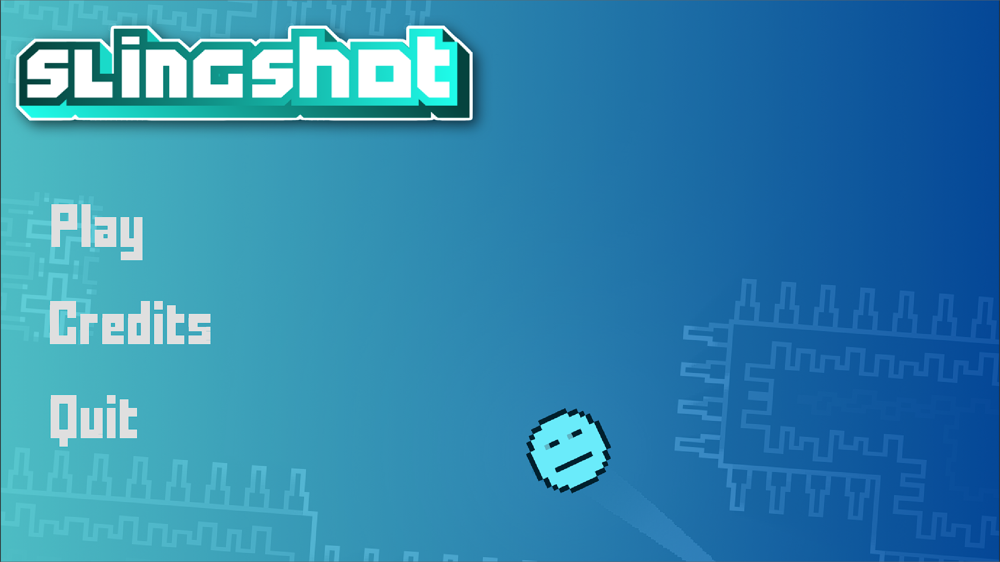
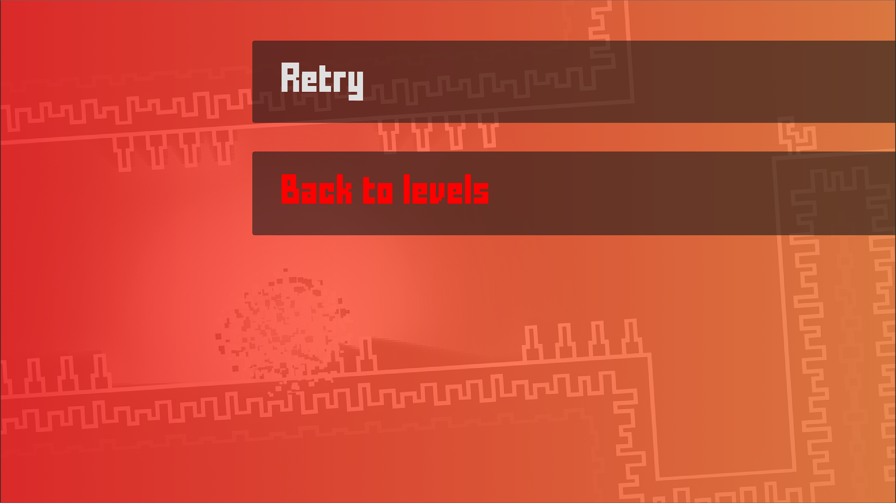
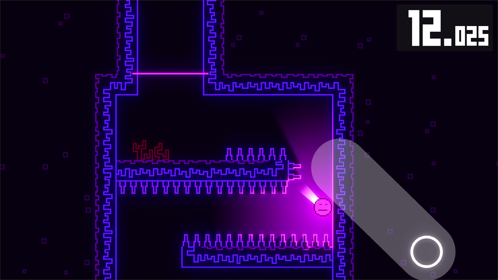
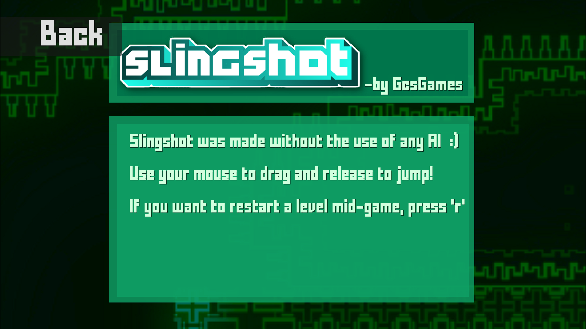

# Slingshot

Slingshot is a physics-based timing and aim game made in Godot. You control the player's trajectory using a slingshot mechanic driven entirely by mouse input. Try to beat each level as quickly as possible!

After completing a level, you receive a star rating based on your completion time—the faster you are, the more stars you earn.

---

## Gameplay

The game is all about precision and timing. Use your mouse to carefully aim your shot and adjust power based on drag distance.

---

## Controls

- **Click and hold (Mouse Left Button)**: Start aiming the slingshot  
- **Drag mouse**: Set direction and power (the farther you drag, the stronger the launch force)  
- **Release mouse button**: Launch the player  
- **R**: Restart the current level  

---

## About

Slingshot combines simple mouse controls with physics-based movement to create a fast, skill-based gameplay loop focused on precision and speed.

